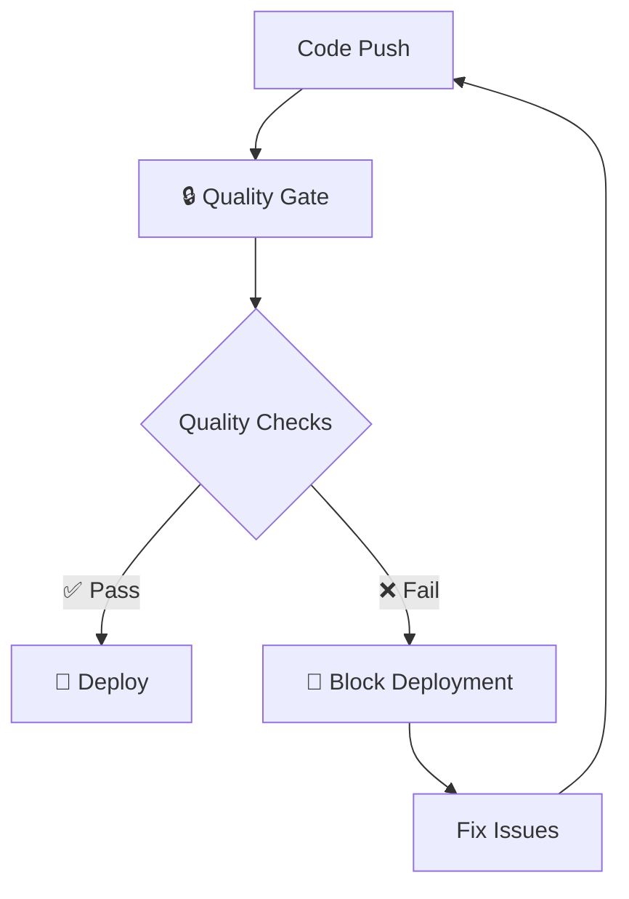

# 🔒 Ultra-Strict CI/CD Pipeline Integration

This document explains how **ultra-strict quality controls** are integrated into the Cawnex CI/CD pipeline to **block deployments** until enterprise-grade code quality standards are met.

## 📊 Pipeline Overview

### 🎯 Quality-First Deployment Strategy

**Every deployment is blocked until ALL quality checks pass:**



---

## 🔧 Workflow Structure

### **Workflow Execution Order:**

1. **🔒 Quality Gate** (MUST pass first)
2. **🚀 Deployment** (only if quality gate passes)
3. **📊 Health Checks** (verify deployed code)

---

## 🔒 Quality Gate Workflow

### **File:** `.github/workflows/0-quality-gate.yml`

**🎯 Purpose:** Enforces ultra-strict quality standards before ANY deployment

### **Triggered By:**

- ✅ Pull requests to `main`
- ✅ Pushes to `main`
- ✅ Manual workflow dispatch

### **Quality Checks Performed:**

#### **🐍 Python Ultra-Strict Validation**

```yaml
python-quality:
  - MyPy type checking (--strict mode)
  - Black code formatting check
  - isort import sorting validation
  - Flake8 linting (zero warnings)
  - Bandit security scanning
  - Tests with 80% coverage requirement
```

**What this catches:**

- ❌ Any untyped functions or variables
- ❌ Code style inconsistencies
- ❌ Security vulnerabilities
- ❌ Insufficient test coverage
- ❌ Complex code (>10 cyclomatic complexity)

#### **⚡ TypeScript Ultra-Strict Validation**

```yaml
typescript-quality:
  - TypeScript strict compilation
  - ESLint zero warnings policy
  - Prettier formatting check
  - CDK synthesis validation
  - npm security audit
```

**What this catches:**

- ❌ Type safety violations
- ❌ Unused variables/imports
- ❌ Code complexity violations
- ❌ Infrastructure syntax errors
- ❌ Dependency vulnerabilities

#### **📱 iOS Swift Ultra-Strict Validation**

```yaml
ios-quality:
  - Swift build with warnings as errors
  - Static analyzer (deep mode)
  - Unit test execution
  - Runtime sanitizer checks
```

**What this catches:**

- ❌ Memory safety issues
- ❌ Concurrency problems
- ❌ Potential crashes
- ❌ Performance issues

### **📊 Quality Gate Results:**

- **✅ All Pass:** Deployment approved
- **❌ Any Fail:** Deployment blocked

---

## 🚀 Deployment Workflows

### **Development Deployment**

**File:** `.github/workflows/1-deploy-dev.yml`

**Enhanced with quality controls:**

```yaml
on:
  workflow_run:
    workflows: ["🔒 Ultra-Strict Quality Gate"]
    types: [completed]
```

**🔒 Quality Integration:**

- ✅ Only runs after quality gate passes
- ✅ Automatic blocking if quality fails
- ✅ Clear error messages for failures

### **Production Deployment**

**File:** `.github/workflows/2-deploy-staging-prod.yml`

**Maximum security for production:**

```yaml
production-quality-gate:
  - Comprehensive quality validation
  - Emergency override option (with warnings)
  - Manual confirmation required
  - Audit trail for all deployments
```

**🔒 Production Safeguards:**

- ✅ **Double confirmation:** Type environment name to confirm
- ✅ **Quality gate:** Run comprehensive checks before production
- ✅ **Override option:** Emergency deployments with audit trail
- ✅ **Blame prevention:** Clear responsibility chain

---

## 🪝 Pre-commit Integration

### **File:** `.pre-commit-config.yaml`

**🎯 Purpose:** Catch quality issues BEFORE they reach CI/CD

### **Local Quality Checks:**

```bash
# Installed automatically on first commit
pre-commit install

# Run manually
pre-commit run --all-files

# Auto-fix common issues
./scripts/quality-control.sh --fix
```

### **What Pre-commit Catches:**

- 🔍 **Code quality** issues before commit
- 🔍 **Security vulnerabilities** in dependencies
- 🔍 **Formatting** inconsistencies
- 🔍 **Secrets** accidentally committed
- 🔍 **Large files** that shouldn't be in git
- 🔍 **Conventional commit** message format

---

## 📊 Quality Metrics & Reporting

### **Automated Reports Include:**

#### **Coverage Reports**

- ✅ Python test coverage (HTML + terminal)
- ✅ Uploaded as workflow artifacts
- ✅ 80% minimum threshold enforced

#### **Security Reports**

- ✅ Bandit security scan results (JSON)
- ✅ npm audit for Node.js dependencies
- ✅ Dependency vulnerability scanning

#### **Code Quality Metrics**

- ✅ Cyclomatic complexity analysis
- ✅ Function length violations
- ✅ Type coverage statistics
- ✅ Linting issue summaries

#### **📈 Trend Tracking**

- Quality check pass/fail rates over time
- Most common violation types
- Developer productivity impact
- Bug detection effectiveness

---

## 🎯 Benefits of Integrated Pipeline

### **✅ Immediate Benefits:**

#### **🚫 Deployment Protection**

- **Zero-defect releases** - No bugs make it to production
- **Consistent quality** - Same standards every deployment
- **Clear feedback** - Developers know exactly what to fix

#### **⚡ Developer Experience**

- **Fast feedback** - Issues caught in minutes, not days
- **Auto-fixing** - Many issues resolved automatically
- **IDE integration** - Real-time quality feedback

#### **🔒 Security First**

- **Vulnerability blocking** - Security issues prevent deployment
- **Secrets protection** - Accidental secret commits prevented
- **Dependency scanning** - Known vulnerabilities detected

### **✅ Long-term Benefits:**

#### **💰 Cost Reduction**

- **Fewer production bugs** - Less time debugging in production
- **Faster development** - Confident refactoring with type safety
- **Team scaling** - New developers can't break existing patterns

#### **🏢 Enterprise Readiness**

- **Audit compliance** - Complete quality audit trails
- **Risk reduction** - Minimal chance of production failures
- **Professional standards** - Code quality meets enterprise expectations

---

## 🛠️ Configuration & Customization

### **Adjusting Quality Thresholds:**

#### **Test Coverage Requirements**

```yaml
# In apps/api/pyproject.toml
[tool.pytest.ini_options]
addopts = ["--cov-fail-under=80"]  # Adjust percentage as needed
```

#### **Complexity Limits**

```yaml
# In .eslintrc.json
"complexity": ["error", 10] # Adjust max complexity
```

#### **TypeScript Strictness**

```json
// In tsconfig.base.json
"compilerOptions": {
  "strict": true,              // Can't be disabled
  "noUnusedLocals": true       // Adjustable per project needs
}
```

### **Emergency Overrides:**

#### **Production Emergency Deployment**

```yaml
# In GitHub Actions UI
inputs:
  quality_gate_override: true # Only for emergencies
```

**⚠️ Override Usage:**

- 🚨 **Only for critical production fixes**
- 📝 **Requires justification in deployment notes**
- 🔄 **Follow-up quality fix required within 24h**

### **Adding New Quality Checks:**

#### **1. Add to Quality Gate Workflow**

```yaml
# In 0-quality-gate.yml
- name: New Quality Check
  run: |
    echo "::group::New Quality Validation"
    ./scripts/new-quality-check.sh
    echo "::endgroup::"
```

#### **2. Add to Pre-commit Hooks**

```yaml
# In .pre-commit-config.yaml
- repo: local
  hooks:
    - id: new-quality-check
      name: 🔍 New Quality Check
      entry: ./scripts/new-quality-check.sh
      language: script
```

#### **3. Update Quality Control Script**

```bash
# In scripts/quality-control.sh
run_check "New Quality Check" "./scripts/new-quality-check.sh"
```

---

## 🔧 Troubleshooting Guide

### **Common Quality Failures:**

#### **🐍 Python Issues**

**MyPy Type Errors:**

```bash
# Fix missing type hints
def function_name(param: str) -> str:
    return param

# Fix implicit Any types
from typing import Dict, List, Optional
```

**Test Coverage Below 80%:**

```bash
# Add missing tests
pytest --cov=src --cov-report=html --cov-report=term-missing
# Open htmlcov/index.html to see uncovered lines
```

**Security Issues (Bandit):**

```bash
# View security report
cat bandit-report.json
# Fix security issues or add # nosec comment with justification
```

#### **⚡ TypeScript Issues**

**ESLint Errors:**

```bash
# Auto-fix many issues
npm run quality:fix

# Check specific issues
npx eslint infra --fix
```

**Type Checking Failures:**

```bash
# Get detailed type errors
npm run type-check:infra
# Fix type annotations and strict mode issues
```

#### **📱 iOS Issues**

**Swift Compilation Errors:**

```bash
# In Xcode, fix all warnings (treated as errors)
# Check static analyzer suggestions
# Resolve memory/concurrency issues
```

### **Debugging Quality Gate Failures:**

#### **1. Run Locally First**

```bash
# Full quality check
./scripts/quality-control.sh

# Quick validation
./scripts/quality-control.sh --quick

# Auto-fix common issues
./scripts/quality-control.sh --fix
```

#### **2. Check Specific Components**

```bash
# Python only
./scripts/quality-control.sh --python

# TypeScript only
./scripts/quality-control.sh --ts

# iOS only (in Xcode)
./scripts/quality-control.sh --ios
```

#### **3. View Detailed Reports**

- **Coverage:** `apps/api/htmlcov/index.html`
- **Security:** `apps/api/bandit-report.json`
- **Type checking:** Terminal output with error codes

---

## 📈 Monitoring & Metrics

### **Quality Dashboard Metrics:**

#### **Pipeline Health**

- ✅ Quality gate pass rate (target: >95%)
- ✅ Average fix time for quality issues
- ✅ Most common failure types
- ✅ Developer productivity impact

#### **Code Quality Trends**

- ✅ Test coverage over time (trend: increasing)
- ✅ Security vulnerabilities found/fixed
- ✅ Code complexity metrics
- ✅ Type safety coverage

#### **Deployment Safety**

- ✅ Production deployment success rate
- ✅ Issues caught by quality gate vs production
- ✅ Emergency override usage frequency
- ✅ Time between deployment and issues

---

## 🎓 Team Onboarding

### **For New Developers:**

#### **1. Setup Local Environment**

```bash
# Install pre-commit hooks
pip install pre-commit
pre-commit install

# Install development tools
cd apps/api && make dev-install
npm install
```

#### **2. Understand Quality Standards**

- 📚 Read `docs/STRICT-CODING-STANDARDS.md`
- 🧪 Run `./scripts/quality-control.sh` locally
- 🔧 Practice fixing quality issues on sample code

#### **3. Development Workflow**

1. **Write code** with strict typing
2. **Run quality checks** locally before committing
3. **Fix issues** immediately rather than accumulating
4. **Commit with conventional messages**
5. **Monitor CI/CD** for any missed issues

### **For Code Reviewers:**

#### **Quality-Focused Reviews**

- ✅ **Quality gate must pass** before review starts
- ✅ **Focus on logic/design** rather than style (automated)
- ✅ **Verify test coverage** for new features
- ✅ **Check error handling** and type safety
- ✅ **Ensure documentation** for complex changes

---

## 🎯 Success Criteria

### **Quality Gate Effectiveness:**

- 🎯 **>95% pass rate** on first run
- 🎯 **<5 minutes** average fix time for failures
- 🎯 **Zero production bugs** from quality issues
- 🎯 **<2% emergency overrides** usage

### **Developer Satisfaction:**

- 🎯 **Positive feedback** on quality automation
- 🎯 **Reduced debugging time** in development
- 🎯 **Confident refactoring** with type safety
- 🎯 **Clear understanding** of quality standards

### **Business Impact:**

- 🎯 **Faster release cycles** with confidence
- 🎯 **Lower maintenance costs** from technical debt
- 🎯 **Higher customer satisfaction** from stable releases
- 🎯 **Easier team scaling** with consistent patterns

---

**🏆 Remember: The integrated CI/CD pipeline with ultra-strict quality controls is designed to enable you to move faster with confidence. The upfront investment in automation pays dividends in reduced debugging, safer deployments, and easier maintenance.**

**Every quality check that blocks a deployment today prevents a production incident tomorrow.** 🛡️
