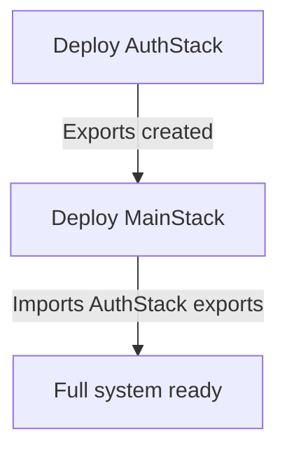

# 🏗️ Two-Stack Deployment Architecture

**Solution:** Separate CDK stacks eliminate circular dependencies and provide clean separation of concerns.

---

## 🎯 **Architecture Overview**

### **Stack 1: CawnexAuthStack** 🔐

**Purpose:** Authentication and user management
**Resources:**

- ✅ Cognito User Pool + clients (iOS + Web)
- ✅ User Pool Domain (`cawnex-{stage}.auth.cognito.us-east-1.amazonaws.com`)
- ✅ PostConfirmation Lambda (tenant creation trigger)
- ✅ RBAC claims injection (pre-token generation)

**Exports:**

```typescript
CawnexAuthStack - { stage } - UserPoolId;
CawnexAuthStack - { stage } - UserPoolArn;
CawnexAuthStack - { stage } - iOSClientId;
CawnexAuthStack - { stage } - WebClientId;
CawnexAuthStack - { stage } - CognitoDomain;
CawnexAuthStack - { stage } - PostConfirmationFnArn;
```

### **Stack 2: Cawnex-{stage}** 🚀

**Purpose:** Core application infrastructure
**Resources:**

- ✅ DynamoDB (multi-tenant single table)
- ✅ S3 (artifacts, file storage)
- ✅ SQS (task queue)
- ✅ API Gateway + Lambda (FastAPI)
- ✅ JWT Authorizer (references AuthStack exports)
- ✅ ECS Fargate (worker orchestrator)
- ✅ CloudFront (CDN)

**Dependencies:**

```typescript
// Imports from AuthStack via CloudFormation exports
const userPoolId = cdk.Fn.importValue(`CawnexAuthStack-${stage}-UserPoolId`);
const iosClientId = cdk.Fn.importValue(`CawnexAuthStack-${stage}-iOSClientId`);
```

---

## 🚀 **Deployment Process**

### **Automatic Deployment Order:**



### **CDK Dependencies:**

```typescript
// infra/bin/cawnex.ts
const authStack = new CawnexAuthStack(app, `CawnexAuthStack-${stage}`, {
  stage,
  env,
});
const mainStack = new CawnexStack(app, `Cawnex-${stage}`, { stage, env });

// Ensure deployment order
mainStack.addDependency(authStack);
```

### **GitHub Actions Workflow:**

```yaml
- name: Deploy Auth Stack
  run: npx cdk deploy CawnexAuthStack-${{ env.STAGE }}

- name: Deploy Main Stack
  run: npx cdk deploy Cawnex-${{ env.STAGE }}
```

---

## ✅ **Benefits of Two-Stack Approach**

### **🔄 No Circular Dependencies:**

```
❌ Before: UserPool → API → JWT Authorizer → UserPool (circular)
✅ After:  AuthStack → MainStack (linear)
```

### **🔧 Clear Separation of Concerns:**

- **AuthStack:** Only authentication/authorization logic
- **MainStack:** Only application business logic

### **📦 Independent Lifecycle:**

- Auth changes don't require API redeployment
- API changes don't affect authentication
- Easier to manage different update frequencies

### **🔒 Security Isolation:**

- Authentication resources isolated in separate stack
- Reduced blast radius for changes
- Clear security boundary

### **👥 Team Ownership:**

- Auth team owns CawnexAuthStack
- API team owns Cawnex MainStack
- Clear responsibilities

---

## 📋 **Deployment Commands**

### **Local Deployment:**

```bash
cd infra

# Deploy both stacks in order
npx cdk deploy CawnexAuthStack-dev Cawnex-dev --context stage=dev

# Or deploy individually
npx cdk deploy CawnexAuthStack-dev --context stage=dev
npx cdk deploy Cawnex-dev --context stage=dev
```

### **GitHub Actions:**

1. **Go to:** https://github.com/eduardoaugustoes/cawnex/actions
2. **Run:** "🚀 Deploy Dev"
3. **Result:** Both stacks deployed automatically + iOS config updated

### **Stack Management:**

```bash
# List stacks
npx cdk list

# Destroy (reverse order)
npx cdk destroy Cawnex-dev
npx cdk destroy CawnexAuthStack-dev

# Diff changes
npx cdk diff CawnexAuthStack-dev
npx cdk diff Cawnex-dev
```

---

## 🔮 **Comparison with Other Patterns**

### **vs. Single Monolithic Stack:**

- ❌ **Monolith:** Circular dependencies, hard to manage
- ✅ **Two-Stack:** Clean separation, no dependency cycles

### **vs. Manual Script Workaround:**

- ❌ **Manual:** Two-step process, security gaps, error-prone
- ✅ **Two-Stack:** Single command, secure throughout, automated

### **vs. Three+ Micro-Stacks:**

- ❌ **Over-engineering:** Too many dependencies, complex orchestration
- ✅ **Two-Stack:** Right balance of separation and simplicity

---

## 🎯 **Best Practices**

### **Stack Naming Convention:**

```
CawnexAuthStack-{stage}  # Authentication
Cawnex-{stage}           # Main application
```

### **Export Naming Convention:**

```
CawnexAuthStack-{stage}-{ResourceType}
# Examples:
CawnexAuthStack-dev-UserPoolId
CawnexAuthStack-prod-iOSClientId
```

### **Update Strategy:**

1. **Auth updates:** Deploy `CawnexAuthStack-{stage}` only
2. **API updates:** Deploy `Cawnex-{stage}` only
3. **Both:** Deploy in order (Auth → Main)

### **Rollback Strategy:**

1. **Rollback Main:** `cdk deploy Cawnex-{stage}` with previous version
2. **Rollback Auth:** More careful - may break Main stack imports
3. **Full rollback:** Rollback Main first, then Auth

---

## 🏆 **Result: Enterprise-Grade Architecture**

**✅ Clean separation of concerns**
**✅ No circular dependencies**
**✅ Single-command deployment**
**✅ Full JWT authentication**
**✅ iOS app automatically configured**
**✅ Production-ready security**

**This follows your established pattern from other apps and industry best practices!** 🚀
